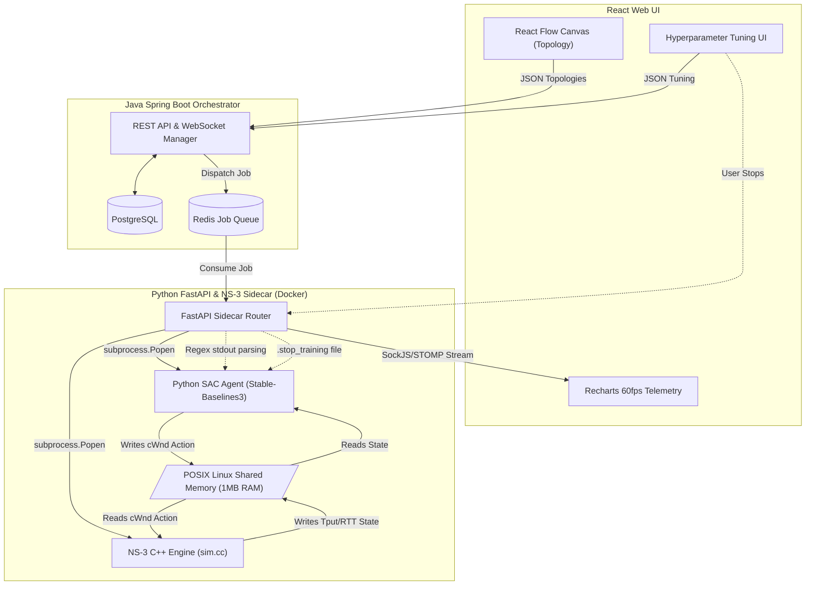

# Adaptive Congestion Control via Deep Reinforcement Learning

> [!NOTE]
> This project implements a state-of-the-art Deep Reinforcement Learning agent to dynamically manage TCP congestion control, supplanting traditional heuristic algorithms.

## 1. Introduction

This project replaces hardcoded, heuristic TCP congestion control algorithms with an intelligent, adaptive machine learning agent. Traditional algorithms like TCP Reno and CUBIC rely on static rules to govern packet flow, reacting poorly to modern, volatile network conditions by either severely underutilizing bandwidth or drastically inflating buffer queues. By integrating a Reinforcement Learning (RL) agent, the system dynamically calculates the optimal Congestion Window (cWnd) and Slow Start Threshold (ssThresh) in real-time, proactively adapting to network conditions to maximize throughput and minimize Round Trip Time (RTT). This predictive capability ensures the network operates near the Bandwidth-Delay Product (BDP) ceiling without incurring packet drops, a significant leap beyond legacy reactive models that inherently rely on packet loss as a primary congestion signal.

## 2. System Architecture

The architecture relies on a multi-language distributed stack to seamlessly bridge the user interface down to low-level network physics. By cleanly decoupling the presentation, orchestration, AI prediction, and simulation layers, the system achieves sub-millisecond latency for AI inference while preserving a robust, responsive web interface. The core pipeline spans from a React frontend, routing through a Java Spring Boot orchestrator, descending into Python FastAPI sidecars, and ultimately binding to a C++ network simulation core via Shared Memory.



### The Frontend Interface
The user interface provides a drag-and-drop canvas for building networks and viewing real-time AI performance metrics. Built with React and React Flow, the visual topology builder allows users to dynamically construct custom network graphs featuring distinct sender nodes, router configurations, and receiver endpoints while configuring individual link speeds. Upon execution, the UI establishes a SockJS and STOMP WebSocket connection to consume continuous telemetry streams, utilizing Recharts to render beautiful, 60fps visual graphs of the AI's current RTT, Throughput, and Episode Reward averages. Additionally, the interface surfaces hyperparameter tuning sliders that dynamically alter the AI's Learning Rate, Network Architecture, and simulation Timesteps, packaging these adjustments into a JSON payload that is transmitted all the way down into the isolated Python training process.

### The Backend Orchestrator
A Java Spring Boot backend manages the overarching state of users, topologies, experiments, and distributed training jobs. Operating as the central brain of the web stack, this orchestrator persists complex network topologies and historical experiment data within a PostgreSQL relational database. When a user initiates a training simulation, the Spring Boot application serializes the parameters and places a job message onto a Redis Queue, enabling scalable, distributed job dispatching across a cluster of worker nodes. This architecture ensures that the intensive workload of network simulation and neural network backpropagation is entirely offloaded from the web server thread pool, maintaining high availability for incoming API requests.

### The Python FastAPI Sidecar
Containerized Python FastAPI sidecars orchestrate the localized execution of the NS-3 simulation and the Reinforcement Learning loops. Operating alongside the NS-3 engine within a Docker container, the FastAPI sidecar retrieves jobs from the Redis queue and utilizes `subprocess.Popen` to independently spawn the C++ simulation and Python SAC training binaries. To capture real-time telemetry without instrumenting the underlying C++ physics engine with HTTP overhead, the sidecar intercepts the terminal `stdout` using robust Regex patterns, piping the metrics directly back to the Java orchestrator via WebSockets. Furthermore, the sidecar implements a deterministic graceful shutdown sequence; when a user halts training, the sidecar touches a `.stop_training` file on the OS file system, which the Python RL loop detects mid-step to cleanly abort training, persist the neural network checkpoint to disk, and carefully detach from the Shared Memory block to eradicate the possibility of orphaned zombie processes.

## 3. The Physics Simulator (NS-3 Engine)

The simulation engine perfectly replicates accurate, packet-level network physics to provide a realistic training environment for the AI. Built on the NS-3 (Network Simulator 3) engine written in C++ (`sim.cc` and `tcp-rl-env.cc`), the core leverages a custom C++ JSON parser to dynamically instantiate nodes, routers, and links precisely mapped to the React frontend's JSON payloads. These low-level C++ constructs simulate rigorous queue disciplines like FqCoDel (Fair Queuing Controlled Delay) to accurately model router bufferbloat and packet transmission dynamics across configurable bandwidths and propagation delays.

> [!WARNING]
> Because traditional TCP transmission rates are highly bursty (forming the classic "TCP Sawtooth" pattern), raw throughput metrics fluctuate violently within microsecond timescales.

To stabilize the mathematical observations fed into the neural network, the C++ engine implements aggressive data smoothing. Over the discrete 40ms simulation timesteps, the engine calculates an Exponential Moving Average (EMA) of both the RTT and the Throughput. This deterministic smoothing acts as a low-pass filter, mitigating the high-frequency noise inherent to the TCP sawtooth, ensuring the Soft Actor-Critic agent receives stable, mathematically coherent state vectors from which to calculate gradients, preventing the policy network from diverging due to extreme variance in the state space.

## 4. Reinforcement Learning Math & Engine

The core intelligence is driven by a Soft Actor-Critic (SAC) reinforcement learning algorithm that continuously optimizes network parameters. Sourced from the Stable-Baselines3 library, SAC is explicitly chosen for its off-policy sample efficiency and its profound capability to natively handle continuous action spaces, which is strictly required when granularly modulating numerical values like the Congestion Window. The algorithm explores the state space by injecting Gaussian noise into its policy and exploits learned advantages via entropy regularization, striking a mathematically rigorous balance between discovering new network capabilities and leveraging established optimal transmission paths. The neural network architecture is intrinsically customizable but defaults to a Multi-Layer Perceptron (MLP) mapping policy across two hidden layers of 256 neurons each `[256, 256]`, offering sufficient parameter capacity to map non-linear relationships between latency variance and link capacity.

| Parameter | Value / Configuration | Purpose |
| :--- | :--- | :--- |
| **Algorithm** | Soft Actor-Critic (SAC) | Off-policy continuous action space optimization. |
| **Network Architecture** | MLP `[256, 256]` | Non-linear policy mapping. |
| **Observation Interval** | 40ms | Dictates the physics simulation discrete timestep. |
| **Train Frequency** | 4 | Executes network updates every 4 environmental steps. |
| **Gradient Steps** | 4 | Number of backpropagation passes per update phase. |
| **Batch Size** | 256 | Number of experience tuples sampled per gradient step. |
| **Replay Buffer** | 1,000,000 | Stores `(s, a, r, s')` tuples for off-policy sampling. |

### The Training Loop
The execution loop coordinates strict timing between observing the physics engine and updating the neural network weights. At a synchronized interval of 40ms, the Python process observes the network state and stores the transition. Operating with a `train_freq` of 4 and `gradient_steps` of 4, the algorithm pulls a highly randomized batch of 256 discrete experiences from a massive 1,000,000-element replay buffer. These parameters guarantee that the twin Q-networks and the policy network undergo symmetrical weight updates, breaking the temporal correlation of sequential network packets and significantly stabilizing the stochastic gradient descent across non-stationary simulated environments.

### Reward Function & BDP Mathematics
The reward function mathematically enforces proportional fairness by optimizing around the theoretical Bandwidth-Delay Product (BDP) of the network link. The agent computes its reward by evaluating its proximity to the optimal BDP state—where throughput is completely maximized yet the router queuing delay remains zero. The system heavily penalizes the agent for exceeding this invisible ceiling, effectively computing negative gradients for actions that inflate the queue or precipitate packet drops. By exposing "AGGRESSIVE", "BALANCED", and "CALM" reward gamma profiles, the reward function coefficients can be dynamically shifted, fundamentally altering the agent's objective landscape to prioritize either absolute throughput or pristine, jitter-free latency.

## 5. POSIX Linux Shared Memory Bridge (IPC)

A custom Inter-Process Communication (IPC) bridge achieves extreme throughput between the C++ simulator and the Python AI by operating entirely within shared RAM. Standard HTTP or local Socket connections introduce unacceptable context-switching overhead and latency spikes when executing thousands of observations per second. To circumvent this, the system implements a custom POSIX Linux Shared Memory (SHM) bridge, mapping a highly optimized 1MB block of physical RAM accessible simultaneously by the NS-3 C++ binaries and the Python SAC process. This contiguous memory block employs atomic locks and strict memory barrier semantics to prevent race conditions during concurrent read/write operations.

> [!IMPORTANT]
> The lifecycle of a single simulation step relies on precise synchronization across the SHM bridge to pause and resume the C++ engine correctly.

The execution cycle operates in strict lockstep across the memory bridge. First, the C++ engine computes 40ms of packet physics, atomically writes the resulting state (Throughput, RTT, Loss metrics) to the 1MB RAM block, and forcibly pauses its thread execution. Subsequently, the Python process reads these floats from the RAM block, feeds the state vector through the SAC neural network to predict the next optimal action, and writes the newly calculated `cWnd` float back into the shared memory segment. Finally, the C++ thread detects the memory update, awakens, injects the new congestion window directly into the active TCP socket state machine, and resumes packet simulation, completing the cycle in a fraction of a millisecond.

## 6. Setup & Usage

Initializing the application stack requires orchestrating the Docker environment alongside the local Node and Java development servers. The architecture is explicitly designed to isolate the complex C++ build environments from the frontend orchestration logic, meaning the underlying NS-3 simulator and Python dependencies are entirely contained within Docker while the React and Spring Boot servers can be run natively for rapid development.

1. **Start the Database and Job Queues:**
   Deploy the underlying PostgreSQL and Redis instances necessary for orchestrating the simulations.
   ```bash
   docker-compose up -d postgres redis
   ```

2. **Build and Run the Simulation Sidecars:**
   Compile the NS-3 C++ bindings and launch the FastAPI Python containers that house the SAC agent.
   ```bash
   docker-compose build engine-sidecar
   docker-compose up -d engine-sidecar
   ```

3. **Launch the Spring Boot Orchestrator:**
   Start the Java application to handle REST and WebSocket routing.
   ```bash
   cd backend
   ./mvnw spring-boot:run
   ```

4. **Boot the React Frontend:**
   Initialize the React application to access the topology canvas and telemetry metrics.
   ```bash
   cd frontend
   npm install
   npm run start
   ```

To gracefully terminate an active training run, use the "Stop Training" button in the React UI, which securely dispatches the API signal triggering the `.stop_training` file creation, ensuring all neural network weights are safely flushed to your local disk before the containers spin down.
